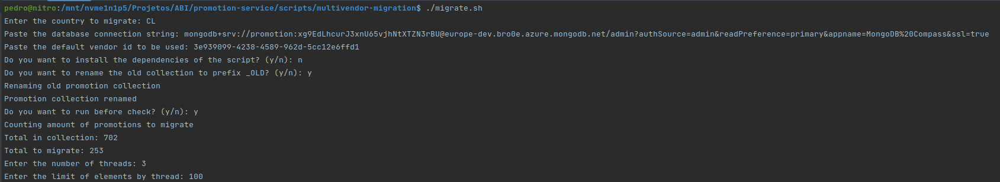
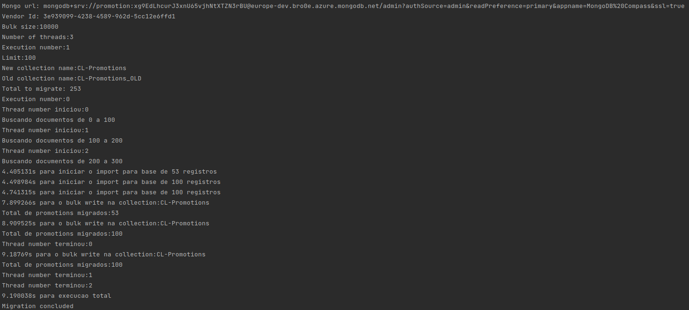

# Promotion Migration #

Application created to perform migration in the promotion collections.

This module was created using Python 3.

## Dependencies
* [mongoshell](https://www.mongodb.com/docs/v4.4/mongo/)
* [pymongo](https://pymongo.readthedocs.io/)
* [dnspython](https://www.dnspython.org/)
* [pytz](https://pypi.org/project/pytz/)
* [python-bsonjs](https://pypi.org/project/python-bsonjs/)
* [requests](https://docs.python-requests.org/en/latest/)
* [bsonjs](https://pypi.org/project/python-bsonjs/)

## Introduction

To perform the migration of promotion, we will have the following steps:

* [Get a user to perform the migration](#get-user-to-migrate).
* [Configure the environment to run the script](#configure-environment).
* [Prepare the consumer module to migration](#prepare-consumers).
* [Run the migration script](#execute-the-script).
* [Validate the results](#check-the-results).
* [Enable consumers](#enable-consumers).


## Get user to migrate

To get a temporary mongo user, just follow the steps in this [link](https://ab-inbev.atlassian.net/wiki/spaces/PKB/pages/2919760206/MongoDB+Atlas+-+Temporary+personal+user+access).

The promotion cluster is the PROD-PILSEN.


## Configure environment

Download and install [mongoshell](https://www.mongodb.com/try/download/community?tck=docs_server)

To setup the environment, just clone the repository [promotion-service](https://ab-inbev.visualstudio.com/GHQ_B2B_Delta/_git/promotion-service).

And navigate to the scripts/multivendor-migration folder.

During the execution of script in first time, you will need to install some [dependencies](#dependencies)

If the script is executed locally, everything is ready for the next steps.
We also have an option to run the script in a vm on azure, for that to contact the cloud-ops team and request the creation of the vm and do the same steps there.

## Prepare consumers

Deactivate the consumers of the country that will be migrated and activate the country as a multi-vendor.

In [bees-microservices repository](https://ab-inbev.visualstudio.com/GHQ_B2B_Delta/_git/bees-microservices?path=/charts/promotion-consumer&version=GBprod&_a=contents), execute the steps below to prepare and activate sync mechanism for the country migrated.

### Scale down pods

Only if the country migrated has specific deployments, scale down pods setting pod.hpa.enabled has false, pod.hpa.minReplicas and pod.hpa.maxReplicas as 0.
```yaml
    pods:
      hpa:
        enabled: false
        minReplicas: 0
        maxReplicas: 0

    deployments:
      ar:
        hpa:
          enabled: false
          minReplicas: 0
          maxReplicas: 0
```

## Execute the script

Execute the [script](migrate.sh) using `./migrate.sh`.

The script will open an interface that will ask for some inputs.

### Type of Migration

Write number 1 - Promotion MultiVendor or 2 - Add field promotionplataformId in collection

### Country

The country that will be performed the migration

### Database connection
Mongodb connection string of the environment

### VendorId (If PromotionMultiVendor)
Default vendorId of country

### Install dependencies
Yes or no - In first time execution is mandatory perform this installation

### Rename collection to prefix _OLD
Yes or no - If you not renamed manually answer y

### Check before the amount to migrate

After choosing the entity, you will be asked if you want to check the amount to be migrated.
If you already have the value, this step can be skipped.

The total it is the total of register inside the single vendor collection.

Total to migrate it is the amount that will be migrated.

Total before it is the amount of register inside the multi-vendor collection.

### Calculating the next values

In the next input of script will be asked for:

* [number of threads](#number-of-threads)
* [limit of elements by thread](#limit-of-elements-by-thread)


We will need the values obtained in the value [checking step](#check-the-amount-to-migrate) to be used in the next inputs.

For example, we have a 500.000 promotions to migrate.
Our amount to migrate will be 500.000.
The limit of elements by thread is a maximum of 150.000.
With this we will have 500.000 promotions divided into 150.000 elements. In this case, we could have a number of threads 4, and limit of elements 150.000 totaling 4 parallel executions. 

Another smaller example, its 4.900 promotions.
We could have a number of threads 1, and limit of elements 5000 totaling 1 execution.

For promotion migrations, for the most part we won't need more than 1 thread.

And all values must be without special characters, like ".,", for example, if the amount to migrate is 50.000.000 must be input 50000000.

### Amount to migrate

This information its important because we use it to calculate the division of registers between the nodes.

### Number of threads

The amount of threads opened in each application.


### limit of elements by thread
The amount of registers opened in each thread.

After set this value, the script will start.

## Example of execution
Run ./migrate.sh



## Check the results

It is possible to open the database and check the registers as well.


## Enable consumers

After the migration is complete, you will need to enable the consumer.

In the [bees-microservices repository](https://ab-inbev.visualstudio.com/GHQ_B2B_Delta/_git/bees-microservices?path=/charts/promotion-consumer&version=GBprod&_a=contents), execute the steps below to turn on the consumers.

If the country migrated has specific deployments, scale up the pods and the hpa in values.yaml file for each deployment.
```yaml
pod:
  hpa: 
    enabled: true
    minReplicas: 20
    maxReplicas: 20
```

## Enable multivendor in Relay and API services  

After the migration is complete, you will need to enable multivendor countries in the Relay and API services.

In the [bees-microservices repository](https://ab-inbev.visualstudio.com/GHQ_B2B_Delta/_git/bees-microservices?path=/charts/promotion-relay-service/values.yaml&version=GBprod&_a=contents), execute the steps below to turn on the relay.
```yaml
sync:
  singleToMultivendorConversionMode:
    activatedCountries: COUNTRY_MIGRATED
```

In the [bees-microservices repository](https://ab-inbev.visualstudio.com/GHQ_B2B_Delta/_git/bees-microservices?path=/charts/promotion-service-ms/values.yaml&version=GBprod&_a=contents), execute the steps below to turn on the API.
```yaml
features:
  multivendor:
    activatedCountries: COUNTRY_MIGRATED
```


## Important Notes

* For execute the script will be needed a connection string with write access.
* The script was tested only in linux environment.
```
db.$Country_promotions.find( { $and: [ { endDate: { $gte: ISODate("2022-03-13T00:00:00.000Z") } }, { deleted: {  $eq: false } } ] } ).count();
```
* For execute the script worth check the hardware of the cluster before, in some cases don't worth create several threads and nodes, because its can overhead the server and slow the operations.
* The default vendor id list is in [confluence](https://ab-inbev.atlassian.net/wiki/spaces/PKB/pages/2241889209/Vendors+Per+Country).

## Ideas for improvement

* Add the script in a pipeline.
* Add more ways to check the results.
